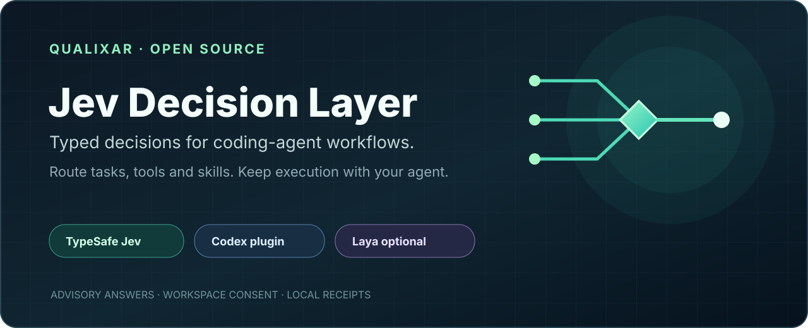
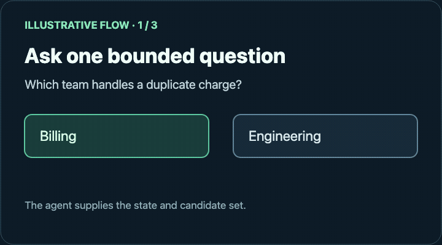
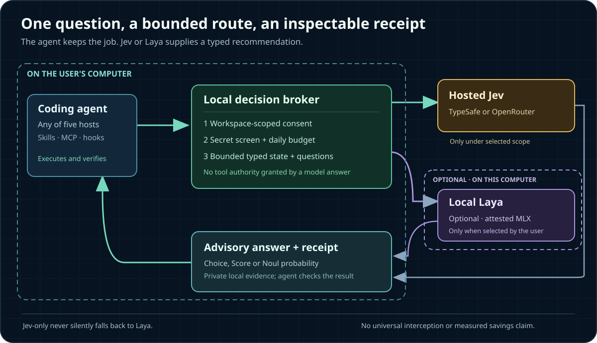

<p align="center"></p>

<h1 align="center">Qualixar Jev Decision Layer</h1>

<p align="center"><strong>Typed decisions for coding agents. Execution stays with the agent.</strong><br>
Route bounded task, tool, skill, and review choices through TypeSafe Jev, with optional local Laya.</p>

<p align="center">
<a href="https://github.com/qualixar/jev-decision-layer/releases/tag/v1.0.5"></a>


</p>

<p align="center"><a href="#install">Get started</a> · <a href="#supported-hosts">Supported hosts</a> · <a href="docs/USE_CASES.md">Explore use cases</a> · <a href="CHANGELOG.md">Changelog</a> · <a href="LICENSE">MIT license</a></p>

<p align="center"></p>

**A decision layer for coding agents, not another chat model.** Give Jev a bounded question—*which tool, skill, task, file, or review path fits this state?*—and get a typed answer with probabilities and a local receipt. Your agent still writes code, uses tools, requests native permissions, and verifies the result. TypeSafe Jev is the primary decision model; [Laya-MLX](https://github.com/mizorewww/laya-mlx) is an optional, separately installed local route.

**One layer, five hosts.** The decision runtime, the recipes, and the policy broker are shared. Each host gets a thin adapter for its own hook contract and plugin manifest — nothing is forked. Support is uneven and the <a href="#supported-hosts">host table</a> says exactly how far each host has been taken.

**Current release: 1.0.5** — 20 MCP tools, 36 recipes, 108 offline fixtures, five host adapters. See the [changelog](CHANGELOG.md).

Built by **Varun Pratap Bhardwaj** under **Qualixar**. This is an independent open-source integration, not an official TypeSafe, OpenAI, Anthropic, Google, or Laya product. [Jev is TypeSafe AI's System One model](https://docs.typesafe.ai/introduction/coding-agents), designed to answer structured questions rather than generate prose.

## What can an agent actually do with it?



*Illustrative flow, not a recording of a provider call. The numbers show the answer shape, not measured accuracy.*

| When you are working on… | What this layer can ask | What remains yours or the host's job |
|---|---|---|
| A coding task | Choose one task, tool, worker, or skill from candidates you supplied | Run the tool, edit code, test, and decide whether to accept the recommendation |
| A large file or search result | Select relevant context blocks and keep exact omitted text recoverable | Read the original source and verify any conclusion |
| A proposed patch | Score review attention and suggest the first area to inspect | Perform independent code review and run tests |
| A browser workflow | When several safe observed controls are plausible, rank a bounded choice; skip Jev for an obvious click | Grant browser access, execute the action, and inspect the resulting page |
| A freelance, creator, research, or support job | Try a typed recipe for brief fit, invoice exceptions, lead routing, citation checks, research ranking, and more | Supply evidence, handle uncertainty, and make consequential decisions |
| A failing step in an agent loop | Decide whether the failure is worth retrying, or whether retrying is waste | Enforce the retry budget, and run whatever is decided |
| A release | Check one requirement against the evidence you supply — version agreement, a changelog entry, test evidence | Inspect the repository, run the build, and decide to publish |
| A long tool result | Decide whether it contains anything that answers the goal, before the host reads it | Keep the original output, which stays authoritative |
| A structured extraction | Check every field against the source and return the probability each one is wrong | Decide what to do with a suspect field; re-extract or escalate |
| A set of retrieved passages | Score them absolutely and say whether they answer the question at all | Read the sources; abstain honestly when told to |

The package has **20 original workflow contracts and 36 data-only recipe specifications**. That is a catalog of use cases, not a claim that Jev is accurate on every user's data. Browse [everyday examples and recipe families](docs/USE_CASES.md), or ask the agent for `jev_recipe_catalog`.

### Prove it before you spend anything

Every recipe ships three synthetic cases — a clear-cut one, a genuinely ambiguous one, and one carrying an instruction hidden in material that is supposed to be data. Replaying all **108** runs the real gate with no provider call, no key, and no workspace enrolment:

```sh
plugins/qualixar-jev-decision-layer/scripts/jev selftest
```

The three variants are enforced, not described: a clear-cut case must clear the gate, and an ambiguous or adversarial one must not. A fixture cannot be made to pass by recording whatever the gate happened to do. A passing run is a contract check on the shipped gate, never evidence of the provider's accuracy.

The TypeSafe question types are [Choice, Score, and Noul](https://docs.typesafe.ai/primitives): a selection from known options, a position on a defined scale, or a yes/no probability. The plugin wraps those answers in policy checks and receipts; it never treats a model answer as permission to act.

### The answer arrives already gated

The host should not have to re-derive, in its own expensive context, the judgment the cheap model was called to settle. Every answer is evaluated locally first and carries a `host_action`:

| `host_action` | What it means | What the host should do |
|---|---|---|
| `act` | Cleared the confidence floor and the distribution bar | Use it. Do not re-reason it — that is the cost the call removed |
| `verify` | A starting point, not a conclusion | Check it. Cheaper than working it out from nothing |
| `ignore` | Below the floor, or the model chose `unknown` | Decide normally. The call still removed a bad option |

**Confidence is not probability.** A distribution can look decisive while the answer is not calibrated, and gating on probability alone passes answers the model is not actually sure of. The gate applies both. A Noul answer carries no confidence field at all — its distance from 0.5 is the certainty.

**The gate fails closed.** A threshold that is missing, malformed, or out of range is a broken gate, not an absent one, and degrades to `verify` rather than `act`. So does a value outside its own domain, a label the model ranked below another, and an `act` that would carry no recommendation.

## How a decision moves through the system



The local broker checks the selected workspace scope, screens recognizable secrets, enforces daily request limits, and sends only the bounded state and questions needed for that call. Jev-only never silently falls back to Laya. In hybrid mode, the separately attested local Laya route can take selected private decisions. The answer returns to the agent as **advice plus an inspectable local receipt**; native tool and browser permissions remain unchanged. See the [security boundary](docs/SECURITY.md).

An optional prompt hook can ask Jev for a relevant file or skill on *eligible* coding prompts. It sends minimized prompt terms and candidate titles, not a whole repository. It is selective: the plugin cannot inspect every hidden choice inside a host or force the model to use a suggestion. It preserves original tool output and hands uncertain answers back to the agent.

For example, a freelancer can supply an enquiry and their own service categories, receive a suggested category and receipt, then decide whether to contact the lead. A creator can supply a brief and draft excerpt, receive an advisory fit judgment, then edit the draft. A developer can supply two plausible skills, receive a ranked suggestion or `unknown`, then choose what to load. A researcher can rank supplied evidence candidates but must still open the original sources.

### One runtime, per-host adapters

The shared runtime lives in `plugins/qualixar-jev-decision-layer/`. A host adapter is small on purpose, because **hook contracts differ in ways that matter for safety**:

| Host | Adapter | Why it differs |
|---|---|---|
| Codex | `jev_auto/hooks.py`, `hooks/hooks.json` | Registers a `PostToolUse` matcher over documented read-only tools |
| Antigravity | `jev_auto/agy_hook.py`, root `hooks.json` | Deliberately does **not** register PreToolUse: that contract requires a permission `decision` and can widen host trust |
| Hermes | `jev_auto/hermes_hook.py`, `jev_auto/hermes_tool.py` | Separate hook and tool entry points |
| Claude Code | `jev_auto/claude_hook.py`, `hooks/claude-hooks.json` | Uses `${CLAUDE_PLUGIN_ROOT}`, not `${PLUGIN_ROOT}`; PreToolUse *can* be advisory-only here, so a hint costs no authority |
| VS Code | `jev_auto/vscode_adapter.py` | No hook surface at all, so the adapter registers the same launcher as a workspace MCP server in `.vscode/mcp.json` |

Three of those hosts also take MCP registration, and they disagree about its shape in ways that fail silently: VS Code keys servers under `servers`, Antigravity and the Claude desktop config under `mcpServers`, and only VS Code expects a `type` field. `jev_auto/host_mcp.py` holds all three shapes in one table with a test per row, and `plugins/qualixar-jev-decision-layer/scripts/jev host-register --host <name>` writes the right one. It plans before it writes, merges rather than replaces, refuses a config it cannot parse, and never prints another server's secrets.

Hook files are **per host and never merged** — the plugin-root variable differs, and Codex registers a matcher Claude Code deliberately does not. See `plugins/qualixar-jev-decision-layer/hooks/README.md`.

## Five operating modes

The first-run wizard shows the exact folder, provider, text scope, expiry, and daily limits before you confirm. A globally installed plugin is available in every project, but **each workspace gets one reviewed scope**; installation alone does not authorize uploading future private repositories.

| Mode | Where a decision goes | Reviewed text scope |
|---|---|---|
| Jev public | TypeSafe or OpenRouter | Public text only |
| Jev reviewed internal | TypeSafe or OpenRouter | Minimized internal text |
| Jev maximum | TypeSafe or OpenRouter | Reviewed workspace text; may include client/confidential material only when you have authority to share it |
| Jev + Laya hybrid | Hosted Jev for reviewed public/internal decisions; attested local Laya for selected restricted decisions | Split by the reviewed policy |
| Laya-only | Local attested Laya; no Jev call | Local decisions |

The secret screen is best-effort, **not comprehensive data-loss prevention**. Jev maximum requires an extra hosted-data confirmation, but that cannot grant permission to disclose somebody else's client or confidential information. Do not submit credentials or material you are not permitted to share. The provider key is entered only in the private setup page and stored in macOS Keychain; do not paste it into chat, a repository file, or a shell argument.

## Install

**Platform for guided v1 setup:** macOS is required for the Keychain-backed hosted Jev wizard. Optional Laya-MLX additionally needs a supported Apple-Silicon macOS installation. This repository does not yet provide a tested Windows/Linux first-run credential flow.

Whichever host you use: **fully quit and reopen it after installing**, so its skills, MCP tools, and hooks reload. A running session binds them at start and will not pick up a new plugin.

For a Codex version upgrade, finish the current task and quit the desktop app **before** refreshing the marketplace from your system terminal. Reopen it after the update. An active task can hold a hook path into the previous version's cache; see the [upgrade and recovery steps](docs/GETTING_STARTED.md#update-an-existing-marketplace-installation).

### Codex Desktop

```sh
codex plugin marketplace add qualixar/jev-decision-layer
codex plugin add qualixar-jev-decision-layer@qualixar-jev-layer
```

### Claude Code

```sh
claude plugin marketplace add qualixar/jev-decision-layer
claude plugin install qualixar-jev-decision-layer@qualixar
```

Adds seven commands — `/jev-setup`, `/jev-status`, `/jev-route`, `/jev-recipes`, `/jev-review`, `/jev-selftest`, `/jev-vscode` — plus the shared skills and the `qualixar-jev` MCP server. Claude Code reads `.claude-plugin/plugin.json`, which points at the Claude-specific hook file.

**Where the MCP server loads.** Plugin-provided MCP servers are read by the Claude Code CLI and by on-machine Cowork sessions. They are **not** loaded by the Claude desktop app's Code tab: there, every enabled plugin that ships a server is equally absent, ours included, with no error and no failed entry. Commands and skills load normally. If you work in the Code tab and want the tools, register the launcher directly instead:

```sh
claude mcp add qualixar-jev -- "$HOME/.claude/plugins/cache/qualixar/qualixar-jev-decision-layer/1.0.5/scripts/launch-jev"
```

For the desktop app specifically, add the same command to `~/Library/Application Support/Claude/claude_desktop_config.json` and restart it. `claude mcp list` reports on the CLI's own config and says nothing about what the desktop app can see.

If your organization sets `allowManagedHooksOnly`, your own `settings.json` hooks are blocked; hooks from a plugin force-enabled in managed `enabledPlugins` are documented as exempt. The MCP tools and commands are unaffected either way.

### VS Code, Antigravity, or the Claude desktop app

```sh
plugins/qualixar-jev-decision-layer/scripts/jev host-register --host vscode --workspace .
```

Prints what it would change and writes nothing. Add `--write` to apply. An existing `.vscode/mcp.json` is merged — one `qualixar-jev` entry is added or updated and every other key is kept — and a file that does not parse is refused rather than overwritten. Restart VS Code afterwards; Copilot agent mode picks the server up from the workspace. `/jev-vscode` does the same from inside Claude Code.

### Antigravity and Hermes

Use the portable plugin source at `plugins/qualixar-jev-decision-layer` with the host's own plugin install path. Antigravity picks up the root `hooks.json` PreInvocation advisory; Hermes uses its own hook and tool entry points.

### Local checkout

Replace `qualixar/jev-decision-layer` with `.` in any command above.

### After installing

Say: **“Set up Qualixar Jev Decision Layer for this workspace.”** The `jev_setup` tool opens a private two-step browser wizard; ordinary users do not need a terminal command for the key or workspace enrollment. Explicit Jev tools are enabled by default after reviewed setup; automatic prompt guidance is **off until you turn it on** in that wizard. Review any native hook-trust prompt separately. The [first-use guide](docs/GETTING_STARTED.md) shows how to verify the provider and receipt without exposing a key.

Then try: **“Use Jev to route this synthetic duplicate-charge request between billing and engineering; show the selected candidate, provider, model, and receipt.”** A live result should name the chosen provider and a local receipt ID. A fixture result is simulated and does not verify provider access. The actual answer may vary; the important proof is the native tool and recorded provider call.

## Supported hosts

Support is **not uniform**, and this table separates what has been observed from what has not. "Evidence" means something was run and produced the stated result. "Boundary" is what that evidence does *not* establish.

| Host | Evidence | Boundary |
|---|---|---|
| **Codex Desktop** | Installed MCP tools and live synthetic TypeSafe routing verified on a Mac | Automatic-hook coverage and savings are not proved by that call |
| **Claude Code** | Plugin installs from the repo marketplace and `claude plugin validate` passes; seven commands and three skills load; the MCP launcher answers an `initialize` handshake; the hook launcher exits cleanly and stays silent on an unenrolled workspace | A native MCP tool turn inside a live session, and hook firing under a host that permits plugin hooks, are **not yet verified**. In the desktop app's **Code tab**, the plugin-provided MCP server does not load at all — see the install note above |
| **Hermes** | Staged plugin doctor registers 9 tools and 1 hook; installed copy awaits refresh | Native model/tool turn still needs verification |
| **Antigravity** | Packaged PreInvocation advisory hook and 2 skills; host adapter previously validated | No portable Jev MCP launcher or native model/tool turn verified |
| **VS Code** | Adapter writes a valid `.vscode/mcp.json` against the documented `servers` format; merge, refusal and symlink behaviour are covered by tests | **No live Copilot agent-mode turn has been run.** No extension ships; registration is the whole integration |

Every recipe also ships three synthetic fixtures — nominal, uncertain and adversarial. `jev_recipe_selftest`, or `plugins/qualixar-jev-decision-layer/scripts/jev selftest`, replays all 108 through the local gate with no provider call, no key and no enrolment, so you can check the gate holds before spending anything. A passing run is a contract check, never a measurement of Jev's accuracy.

The optional Laya worker has completed local synthetic inference and macOS sandbox file/network-denial tests. Those results do not prove a particular GPU path or native host interception. The [capability manifest](docs/capabilities.json) and [agent-readable index](llms.txt) provide machine-readable pointers; the table above is the human-facing support boundary.

## About token, cost, and time savings

This release has **no measured token, subscription-cost, API-cost, or task-time savings claim** on any host. A Jev request has provider overhead and can make a task slower if it avoids no work. The broker reports actual calls and bytes; its saved-token and saved-cost fields remain unknown until matched, independently accepted host-task trials exist. Do not treat shorter text or fewer visible calls as proof of savings. Recipe and suggestion thresholds are uncalibrated demonstration defaults, not universal decision cutoffs.

## Build on it

The source is MIT-licensed. Add a data-only recipe with explicit input fields, a typed question, synthetic normal/uncertain/adversarial fixtures, and an honest limitation; see [CONTRIBUTING.md](CONTRIBUTING.md). Adding a host means writing one adapter against that host's hook contract and its own hook file — never editing another host's. The [rollback guide](docs/ROLLBACK.md) removes the plugin without deleting your project. Upstream code and model rights remain with their authors; see [third-party notices](plugins/qualixar-jev-decision-layer/THIRD_PARTY_NOTICES.md). No Jev or Laya model weights are included.
