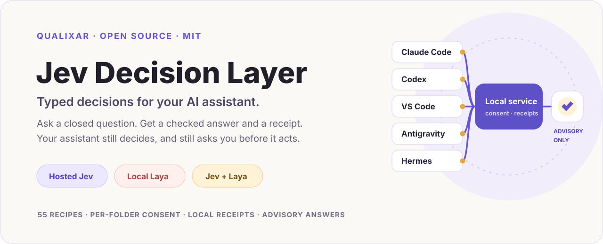
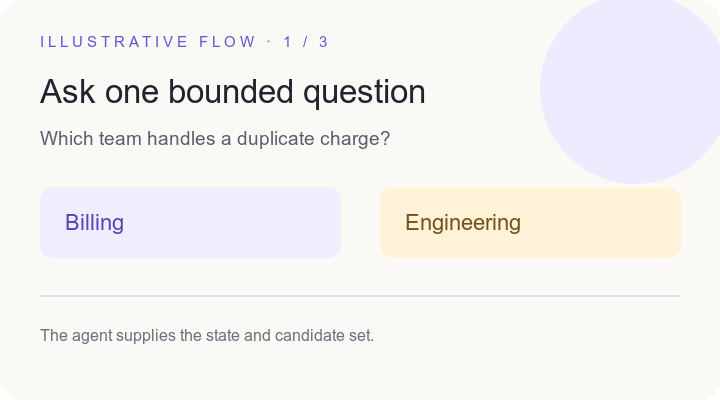
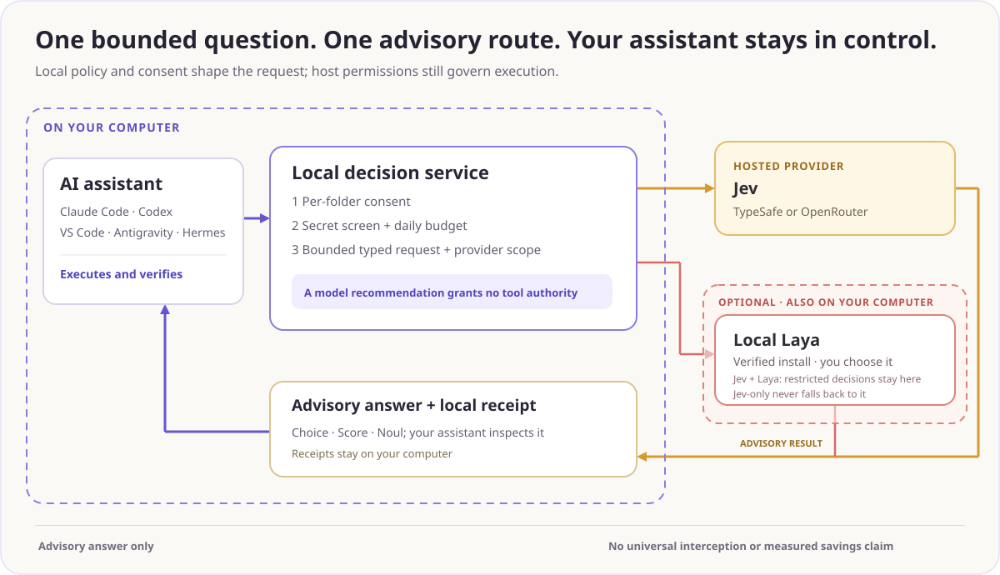

<p align="center"></p>

<h1 align="center">Qualixar Jev Decision Layer for AI Agents</h1>

<p align="center"><strong>Fast, typed decisions for agent harnesses. Local gates and receipts for every choice.</strong><br>
Route tasks, tools, skills, tests, and reviews through TypeSafe Jev, with optional local Laya-MLX on Apple Silicon.</p>

<p align="center">
<a href="https://github.com/qualixar/jev-decision-layer/releases/tag/v1.0.8"></a>


</p>

<p align="center"><a href="#60-second-example">See a bounded decision</a> · <a href="#why-an-ai-agent-decision-layer-instead-of-a-direct-jev-call">Why a layer?</a> · <a href="#install">Install</a> · <a href="#supported-hosts">Host evidence</a> · <a href="docs/USE_CASES.md">Use cases</a> · <a href="CHANGELOG.md">Changelog</a> · <a href="LICENSE">MIT license</a></p>

<p align="center"></p>

<p align="center"><strong>Not every decision inside a coding agent needs another chat-model turn.</strong></p>

**Qualixar Jev Decision Layer is an open-source MCP decision layer for AI agent harnesses.** It routes bounded choices—task routing, tool selection, skill choice, file ranking, test selection, and review priority—to hosted [TypeSafe Jev](https://docs.typesafe.ai/introduction/coding-agents) or optional [local Laya-MLX](https://github.com/mizorewww/laya-mlx). A local policy gate checks the typed answer and records a receipt. The agent's host keeps permission to execute and verify the work.

**Why Jev for the decision step?** TypeSafe's [published System One workflow comparisons](https://typesafe.ai/blog/introducing-system-one-models-and-jev) report Jev at **193.6× faster and 444.6× cheaper** than the LLM reference on those workflows. Its [model pricing](https://docs.typesafe.ai/models) lists **$0.042 per million input tokens**, with output tokens free. Qualixar connects that fast decision primitive to reusable agent recipes, local gates, workspace controls, and evidence you can inspect.

One shared runtime has adapters for **Codex, Claude Code, VS Code, Hermes, and Antigravity**. Those adapters do not have equal live-verification evidence; the [host table](#supported-hosts) states what has and has not been run.

**Why use a layer instead of calling Jev directly?** The model call is one step in an agent workflow. This repository adds reusable decision contracts, workspace scope and request controls, a local answer gate, receipts, optional local routing, and host-specific adapters behind one shared runtime.

**The model recommends; the host retains execution authority.** A Jev or Laya answer does not grant shell, file, browser, deployment, or publishing permission. Host support is not equally verified; see the [evidence and boundary table](#supported-hosts).

**Current release: 1.0.8** — 20 MCP tools, 38 recipes for bounded decisions, 114 synthetic offline fixtures, and five host adapters. The live recipe gate caps every would-be passing result to `verify` until a recipe has been evaluated against labeled provider answers. Version 1.0.8 is supported and verified on macOS. Linux remains experimental and unverified; Windows hosted operation is disabled in this release because its native private-state contract did not pass CI. Local Laya-MLX is limited to supported Apple-Silicon Macs. See the [host evidence](docs/HOSTS.md) and [changelog](CHANGELOG.md).

Built by **Varun Pratap Bhardwaj** under **Qualixar**. This is an independent open-source integration, not an official TypeSafe, OpenAI, Anthropic, Google, Microsoft, or Laya product.

## 60-second example

Install the plugin, complete the reviewed workspace setup, then ask your agent:

> Route this synthetic duplicate-charge request between `billing` and `engineering`. Show the selected candidate, provider, model, route status, and receipt ID.

The prompt supplies a closed choice. A live result identifies the provider/model, route status, and receipt; the selected candidate may vary. This route example does not return the recipe-specific `host_action`. The animation in [What can an agent actually do with it?](#what-can-an-agent-actually-do-with-it) illustrates the answer flow.

```text
Synthetic request + supplied candidates
                 ↓
        Typed Jev decision
                 ↓
       Local policy gate
                 ↓
    act / verify / ignore + receipt
                 ↓
      Host decides what to do
```

## Why an AI agent decision layer instead of a direct Jev call?

| A direct Jev call gives you | This layer adds |
|---|---|
| A typed answer from the selected provider | One shared runtime with host-specific adapters |
| A question you define for one call | 20 reusable legacy workflow contracts plus a catalog of 38 data-only recipe specifications; the 20 legacy workflows correspond to 20 of those 38 recipes, so these counts are not additive |
| Provider output | Workspace/provider scope, request limits, local `act / verify / ignore` gate, and a receipt |
| A hosted decision route | An optional, separately installed local Laya-MLX route for eligible decisions |
| Whatever validation you build around that call | 114 synthetic offline fixtures that exercise the shipped local gate, without a provider call |

The layer is useful when you need those controls and integrations as part of a repeatable workflow. It does not make a provider answer correct by itself, and it does not replace host permissions.

### Useful beyond the developer workflow

A manager can compare a work item against a rubric and priorities they provide. A content creator can choose among short video, newsletter, or carousel formats using a supplied brief. A junior developer can ask for a bounded tool or skill suggestion. In every case, the person supplies context, reviews the advisory answer, and decides what happens next. The [recipe workbench](docs/GETTING_STARTED.md#let-a-non-developer-explore-a-recipe) offers a local form and offline examples for people who do not want to compose MCP JSON.

## Jev, local Laya, or hybrid?

Use hosted Jev for a reviewed decision whose data scope permits a provider call. OpenRouter is a separate hosted provider route. Version 1.0.8 is supported on macOS; Linux is experimental and unverified, and Windows hosted runtime entry points fail closed. Use optional local Laya-MLX only on a supported Apple-Silicon Mac after local attestation. Hybrid mode follows the workspace policy you reviewed. Provider behavior is not assumed to be interchangeable; see [provider thresholds and evidence](#provider-thresholds-and-evidence).

## What can an agent actually do with it?



*Illustrative flow, not a recording of a provider call. The numbers show the answer shape, not measured accuracy.*

| When you are working on… | What this layer can ask | What remains yours or the host's job |
|---|---|---|
| A coding task | Choose one task, tool, worker, or skill from candidates you supplied | Run the tool, edit code, test, and decide whether to accept the recommendation |
| A large file or search result | Select relevant context blocks and keep exact omitted text recoverable | Read the original source and verify any conclusion |
| A proposed patch | Score review attention and suggest the first area to inspect | Perform independent code review and run tests |
| A browser workflow | When several safe observed controls are plausible, rank a bounded choice; skip Jev for an obvious click | Grant browser access, execute the action, and inspect the resulting page |
| A freelance, creator, research, or support job | Try a typed recipe for brief fit, invoice exceptions, lead routing, citation checks, research ranking, and more | Supply evidence, handle uncertainty, and make consequential decisions |
| A failing step in an agent loop | Decide whether the failure is worth retrying, or whether retrying is waste | Enforce the retry budget, and run whatever is decided |
| A release | Check one requirement against the evidence you supply — version agreement, a changelog entry, test evidence | Inspect the repository, run the build, and decide to publish |
| A long tool result | Decide whether it contains anything that answers the goal, before the host reads it | Keep the original output, which stays authoritative |
| A structured extraction | Check every field against the source and return the probability each one is wrong | Decide what to do with a suspect field; re-extract or escalate |
| A set of retrieved passages | Score them absolutely and say whether they answer the question at all | Read the sources; abstain honestly when told to |

The package has **38 distinct data-only recipe specifications**. Its 20 original workflow contracts correspond to 20 of those recipes; they are not 20 additional recipes. The two new recipes include work-item prioritization for managers and content-format selection for creators. This is a catalog of bounded use cases, not a claim that Jev is accurate on every user's data. Browse [everyday examples and recipe families](docs/USE_CASES.md), or ask the agent for `jev_recipe_catalog`.

### Prove it before you spend anything

Every recipe ships three synthetic cases — a clear-cut one, a genuinely ambiguous one, and one carrying an instruction hidden in material that is supposed to be data. Replaying all **114** runs the real gate with no provider call, no key, and no workspace enrolment:

```sh
plugins/qualixar-jev-decision-layer/scripts/jev selftest
```

The three variants are enforced, not described: a clear-cut case must clear the gate, and an ambiguous or adversarial one must not. A fixture cannot be made to pass by recording whatever the gate happened to do. A passing run is a contract check on the shipped gate, never evidence of the provider's accuracy.

The TypeSafe question types are [Choice, Score, and Noul](https://docs.typesafe.ai/primitives): a selection from known options, a position on a defined scale, or a yes/no probability. The plugin wraps those answers in policy checks and receipts; it never treats a model answer as permission to act.

### The answer arrives already gated

For a live `jev_recipe_try`, the packaged gate evaluates the typed answer and returns a `host_action` plus a policy receipt ID. This describes a policy result; it does not run the recommendation or authorize execution.

| `host_action` | What it means | What the host should do |
|---|---|---|
| `act` | The answer passed the configured gate | No shipped recipe can retain `act` in 1.0.8: all are `SPECIFICATION_NOT_MODEL_EVALUATED`, so a would-be `act` is capped to `verify` |
| `verify` | Check the advisory answer independently | This is the maximum action for a would-be passing result from every shipped recipe in 1.0.8 |
| `ignore` | The model selected `unknown` | Do not use a recommendation; decide normally |

The `jev_recipe_try` response is marked `EXPERIMENTAL_ADVISORY`. Its policy receipt records the recipe status, provider receipt ID, provider/model, and local gate result. The answer and receipt do not prove provider accuracy, authorize an operation, or execute anything. A below-threshold or malformed answer remains `verify`; an explicit `unknown` may return `ignore`.

**Confidence is a summary of the distribution, not independent accuracy evidence.** [TypeSafe derives Choice and Score confidence from their reported probabilities](https://docs.typesafe.ai/confidence). The recipe gate applies both its configured confidence floor and probability bar as conservative policy settings; neither is calibrated on this repository's tasks. A Noul answer carries no confidence field, so its yes/no bands apply directly to its value.

**The gate fails closed.** A threshold that is missing, malformed, or out of range is a broken gate, not an absent one, and degrades to `verify` rather than `act`. So does a value outside its own domain, a label the model ranked below another, and an `act` that would carry no recommendation.

## How a decision moves through the system



The local broker checks the selected workspace scope, screens recognizable secrets, enforces daily request limits, and sends only the bounded state and questions needed for that call. Jev-only never silently falls back to Laya. In hybrid mode, the separately attested local Laya route can take selected private decisions. The answer returns to the agent as **advice plus an inspectable local receipt**; native tool and browser permissions remain unchanged. See the [security boundary](docs/SECURITY.md).

An optional prompt hook can ask Jev for a relevant file or skill on *eligible* coding prompts. It sends minimized prompt terms and candidate titles, not a whole repository. It is selective: the plugin cannot inspect every hidden choice inside a host or force the model to use a suggestion. It preserves original tool output and hands uncertain answers back to the agent.

For example, a freelancer can supply an enquiry and their own service categories, receive a suggested category and receipt, then decide whether to contact the lead. A creator can supply a brief and draft excerpt, receive an advisory fit judgment, then edit the draft. A developer can supply two plausible skills, receive a ranked suggestion or `unknown`, then choose what to load. A researcher can rank supplied evidence candidates but must still open the original sources.

### One runtime, per-host adapters

The shared runtime lives in `plugins/qualixar-jev-decision-layer/`. A host adapter is small on purpose, because **hook contracts differ in ways that matter for safety**:

| Host | Adapter | Why it differs |
|---|---|---|
| Codex | `jev_auto/hooks.py`, `hooks/codex-hooks.json` | Registers a `PostToolUse` matcher over documented read-only tools |
| Antigravity | `jev_auto/agy_hook.py`, root `hooks.json` | Deliberately does **not** register PreToolUse: that contract requires a permission `decision` and can widen host trust |
| Hermes | `jev_auto/hermes_hook.py`, `jev_auto/hermes_tool.py` | Separate hook and tool entry points |
| Claude Code | `jev_auto/claude_hook.py`, `hooks/claude-hooks.json` | Uses `${CLAUDE_PLUGIN_ROOT}`, not `${PLUGIN_ROOT}`; PreToolUse *can* be advisory-only here, so a hint costs no authority |
| VS Code | `jev_auto/vscode_adapter.py` | No hook surface at all, so the adapter registers the same launcher as a workspace MCP server in `.vscode/mcp.json` |

Three of those hosts also take MCP registration, and they disagree about its shape in ways that fail silently: VS Code keys servers under `servers`, Antigravity and the Claude desktop config under `mcpServers`, and only VS Code expects a `type` field. `jev_auto/host_mcp.py` holds those shapes in one table with a test per row. `plugins/qualixar-jev-decision-layer/scripts/jev host-register --host <name>` previews registration; on supported macOS, `--write` merges one entry without printing another server's secrets. Linux registration is experimental and unverified. Windows runtime support is disabled in 1.0.8.

Hook files are **per host and never merged** — the plugin-root variable differs, and Codex registers a matcher Claude Code deliberately does not. See `plugins/qualixar-jev-decision-layer/hooks/README.md`.

## Five operating modes

The first-run wizard shows the exact folder, provider, text scope, expiry, and daily limits before you confirm. A globally installed plugin is available in every project, but **each workspace gets one reviewed scope**; installation alone does not authorize uploading future private repositories.

| Mode | Where a decision goes | Reviewed text scope |
|---|---|---|
| Jev public | TypeSafe or OpenRouter | Public text only |
| Jev reviewed internal | TypeSafe or OpenRouter | Minimized internal text |
| Jev maximum | TypeSafe or OpenRouter | Reviewed workspace text; may include client/confidential material only when you have authority to share it |
| Jev + Laya hybrid | Hosted Jev for reviewed public/internal decisions; attested local Laya for selected restricted decisions | Split by the reviewed policy |
| Laya-only | Local attested Laya; no Jev call | Local decisions |

The secret screen is best-effort, **not comprehensive data-loss prevention**. Jev maximum requires an extra hosted-data confirmation, but that cannot grant permission to disclose somebody else's client or confidential information. Do not submit credentials or material you are not permitted to share. The provider key is entered only in the private setup page and stored by the platform credential store; do not paste it into chat, a repository file, or a shell argument. Availability and native verification differ by operating system; see [host and platform evidence](docs/HOSTS.md).

## Provider thresholds and evidence

The shipped recipe floors are demonstration policy settings. The repository does not contain a reproducible, labeled provider evaluation sufficient to tune separate TypeSafe and Laya thresholds, so the local Laya route currently uses each recipe's unchanged floor. Its provider profile reports `UNVALIDATED_DEMONSTRATION_DEFAULT` with zero qualifying evaluation samples. The 114 offline fixtures check the local contract against hand-authored answers; they do not measure provider correctness, calibration, cost saved, or latency saved. Provider-specific thresholds require a labeled test set, a documented model revision, and held-out validation before they can be claimed.

## Install

**Hosted platform scope for 1.0.8:** TypeSafe Jev and OpenRouter are supported and verified on macOS through Keychain. Linux code is experimental and unverified; passing generic Linux tests does not establish the Secret Service and host integration path. Windows hosted runtime entry points fail closed because its native private-state contract did not pass CI. Local Laya-MLX remains limited to compatible Apple-Silicon Macs and requires local attestation.

Whichever host you use: **fully quit and reopen it after installing**, so its skills, MCP tools, and hooks reload. A running session binds them at start and will not pick up a new plugin.

For a Codex version upgrade, finish the current task and quit the desktop app **before** refreshing the marketplace from your system terminal. Reopen it after the update. An active task can hold a hook path into the previous version's cache; see the [upgrade and recovery steps](docs/GETTING_STARTED.md).

### Codex Desktop

```sh
codex plugin marketplace add qualixar/jev-decision-layer
codex plugin add qualixar-jev-decision-layer@qualixar-jev-layer
```

### Claude Code

```sh
claude plugin marketplace add qualixar/jev-decision-layer
claude plugin install qualixar-jev-decision-layer@qualixar
```

Adds seven commands — `/jev-setup`, `/jev-status`, `/jev-route`, `/jev-recipes`, `/jev-review`, `/jev-selftest`, `/jev-vscode` — plus the shared skills and the `qualixar-jev` MCP server. Claude Code reads `.claude-plugin/plugin.json`, which points at the Claude-specific hook file.

**Where the MCP server loads.** Plugin-provided MCP servers are read by the Claude Code CLI and by on-machine Cowork sessions. They are **not** loaded by the Claude desktop app's Code tab: there, every enabled plugin that ships a server is equally absent, ours included, with no error and no failed entry. Commands and skills load normally. If you work in the Code tab and want the tools, register the launcher directly instead:

```sh
claude mcp add qualixar-jev -- "$HOME/.claude/plugins/cache/qualixar/qualixar-jev-decision-layer/1.0.8/scripts/launch-jev"
```

For the desktop app specifically, add the same command to `~/Library/Application Support/Claude/claude_desktop_config.json` and restart it. `claude mcp list` reports on the CLI's own config and says nothing about what the desktop app can see.

If your organization sets `allowManagedHooksOnly`, your own `settings.json` hooks are blocked; hooks from a plugin force-enabled in managed `enabledPlugins` are documented as exempt. The MCP tools and commands are unaffected either way.

### VS Code, Antigravity, or the Claude desktop app

```sh
plugins/qualixar-jev-decision-layer/scripts/jev host-register --host vscode --workspace .
```

Prints what it would change and writes nothing. Add `--write` to apply on supported macOS. An existing `.vscode/mcp.json` is merged — one `qualixar-jev` entry is added or updated and every other key is kept — and a file that does not parse is refused rather than overwritten. Restart VS Code afterwards; Copilot agent mode picks the server up from the workspace. `/jev-vscode` does the same from inside Claude Code. Linux registration is experimental and unverified; Windows CLI runtime commands are disabled in 1.0.8.

### Antigravity and Hermes

Use the portable plugin source at `plugins/qualixar-jev-decision-layer` with the host's own plugin install path. Antigravity picks up the root `hooks.json` PreInvocation advisory; Hermes uses its own hook and tool entry points.

### Local checkout

Replace `qualixar/jev-decision-layer` with `.` in any command above.

### After installing

Before opening private setup, run the offline diagnosis from a local repository checkout against the project folder you intend to use:

```sh
plugins/qualixar-jev-decision-layer/scripts/jev doctor --workspace /absolute/path/to/your/project
```

`jev doctor` is **offline-only** and makes no provider call. It checks the packaged runtime, Python requirement, workspace policy, offline fixtures, local receipt index, and presence of the portable runtime. Before setup, `ACTION_REQUIRED` with `NOT_ENROLLED` and exit status `2` is expected; this check does not prove that the host loaded the plugin or completed a live turn. After private setup, make any provider check separately through an explicit Jev route or the existing `jev probe --workspace /absolute/path/to/your/project` command. That is provider activity, not part of `doctor`. If you installed from the marketplace without cloning the repository, follow the [first-use guide](docs/GETTING_STARTED.md) for the host wizard; the plugin install does not add a global `jev` shell command.

Say: **“Set up Qualixar Jev Decision Layer for this workspace.”** The `jev_setup` tool opens a private two-step browser wizard; ordinary users do not need a terminal command for the key or workspace enrollment. Explicit Jev tools are enabled by default after reviewed setup; automatic prompt guidance is **off until you turn it on** in that wizard. Review any native hook-trust prompt separately. The [first-use guide](docs/GETTING_STARTED.md) shows how to verify the provider and receipt without exposing a key.

Then try: **“Use Jev to route this synthetic duplicate-charge request between billing and engineering; show the selected candidate, provider, model, and receipt.”** A live result should name the chosen provider and a local receipt ID. A fixture result is simulated and does not verify provider access. The actual answer may vary; the important proof is the native tool and recorded provider call.

## Supported hosts

Support is **not uniform**, and this table separates what has been observed from what has not. "Evidence" means something was run and produced the stated result. "Boundary" is what that evidence does *not* establish.

| Host | Evidence | Boundary |
|---|---|---|
| **Codex** | Installed MCP tools and live synthetic TypeSafe routing verified on macOS; native Codex hook is a separate reviewed capability | Linux operation and automatic-hook coverage require separate host checks; Windows hosted runtime is disabled in 1.0.8 |
| **Claude Code** | Plugin installs from the repo marketplace and `claude plugin validate` passes; seven commands and three skills load; the MCP launcher answers an `initialize` handshake; the hook launcher exits cleanly and stays silent on an unenrolled workspace | A native MCP tool turn inside a live session, and hook firing under a host that permits plugin hooks, are **not yet verified**. In the desktop app's **Code tab**, the plugin-provided MCP server does not load at all — see the install note above |
| **Hermes** | Staged plugin doctor registers the declared tools and hook; installed copy awaits refresh | Native model/tool turn still needs verification |
| **Antigravity** | Packaged PreInvocation advisory hook and skills; this adapter does not request PreToolUse authority | Native model/tool turn and portable MCP registration still need verification |
| **VS Code** | Adapter writes a valid `.vscode/mcp.json` against the documented `servers` format; merge, refusal and symlink behaviour are covered by tests | **No live Copilot agent-mode turn has been run.** No extension ships; registration is the whole integration |

Every recipe also ships three synthetic fixtures — nominal, uncertain and adversarial. `jev_recipe_selftest`, or `plugins/qualixar-jev-decision-layer/scripts/jev selftest`, replays all 114 through the local gate with no provider call, no key and no enrolment, so you can check the gate holds before a live call. A passing run is a contract check, never a measurement of Jev's accuracy.

The optional Laya worker has completed local synthetic inference and macOS sandbox file/network-denial tests. Those results do not prove a particular GPU path or native host interception. The [capability manifest](docs/capabilities.json) and [agent-readable index](llms.txt) provide machine-readable pointers; the table above is the human-facing support boundary.

## Measure each decision

The broker reports provider calls and bytes, and the decision receipt lets you inspect what happened for a bounded choice. For task-level token, cost, and speed comparisons, use paired runs with the same host and an independently checked outcome. Recipe thresholds are configurable starting points; validate them against your own tasks before relying on an automatic action.

## Frequently asked questions

### What is Qualixar Jev Decision Layer?

It is an open-source MCP decision layer that connects agent harnesses to TypeSafe Jev for typed, bounded choices. It adds reusable recipes, workspace controls, local policy gates, and receipts around the model call. Codex, Claude Code, Hermes, Antigravity, and VS Code use host-specific adapters to reach the shared runtime.

### Can Jev reduce AI agent token costs?

For a narrow choice that Jev handles directly, an agent can reserve its general-purpose model for generation and execution instead of using another chat-model answer for the decision. TypeSafe publishes [workflow speed and cost comparisons](https://typesafe.ai/blog/introducing-system-one-models-and-jev); the local receipt shows the decision used in your own workflow.

### Does this replace Codex, Claude Code, or the agent's main LLM?

No. Jev returns a typed recommendation for a bounded question. The host still controls file changes, shell commands, browser actions, approvals, and the final artifact. The local gate can return `act`, `verify`, or `ignore` as policy metadata; it does not grant execution permission.

### Can a manager or content creator use it without writing MCP JSON?

Yes. The local [recipe workbench](docs/GETTING_STARTED.md#let-a-non-developer-explore-a-recipe) presents forms and offline examples. A manager can compare a work item against supplied priorities; a creator can select a format from supplied options. Both review the recommendation before acting.

## Build on it

The source is MIT-licensed. Add a data-only recipe with explicit input fields, a typed question, synthetic normal/uncertain/adversarial fixtures, and an honest limitation; see [CONTRIBUTING.md](CONTRIBUTING.md). Adding a host means writing one adapter against that host's hook contract and its own hook file — never editing another host's. The [rollback guide](docs/ROLLBACK.md) removes the plugin without deleting your project. Upstream code and model rights remain with their authors; see [third-party notices](plugins/qualixar-jev-decision-layer/THIRD_PARTY_NOTICES.md). No Jev or Laya model weights are included.
